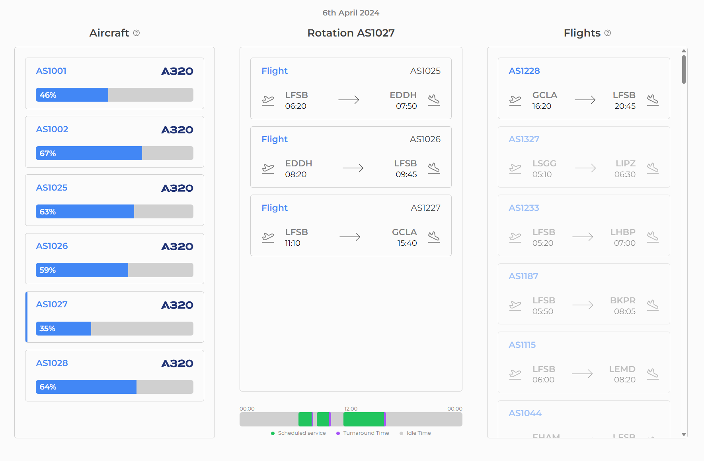

# Aircraft Scheduling Project - React + Vite + TS

This project is a single page application with the goal of managing an airline's fleet and each aircraft's flight rotation.

The page consists of 3 columns: on the left, a list of all the available aircraft on the fleet; in the middle, the scheduled flight rotation for the selected aircraft and the aircraft's timeline; on the right, a list of all flights, whether they're available or not.

Data was fetched from the provided endpoints.

Here's a preview of the page:



## How to Run

1. Install the dependencies:

```
npm i
```

2. Run the application:

```
npm run dev
```

3. Application will be ready at [http://localhost:5173/](http://localhost:5173/).

## Assumptions

- Based on the endpoint provided data, all aircraft are based on "EGKK" (Gatwick Airport), but there're no flights departing from "EGKK", so I assumed the first flight of each aircraft have no departure airport constraints.

- Since the flights endpoint only return flights for a single day, and the documentation mentioned it could be simplified, it does not have multiple day support so far, but it would not be hard to implement.

- Since there's no back-end or database, I assumed saving the data in-memory (with a React Context) was enough.

## Extra Features

- **Responsive Design:** the application is ready and optimized for mobile/smaller viewports.

- **UI Animations:** card lists, loading state, dialogs and percentage bars all have smooth transitions and animations.

- **Interactive Tooltips:** tooltips were added to add guidance and information to the user.

## Helper Libraries

- **Lucide Icons:** simple and beautiful icons to enhance the UI.

- **Date-fns:** date handling library.

- **Framer Motion:** complex animations and transitions.

- **Lodash:** utility functions and helpers.

- **Usehooks-ts:** utility hooks.
